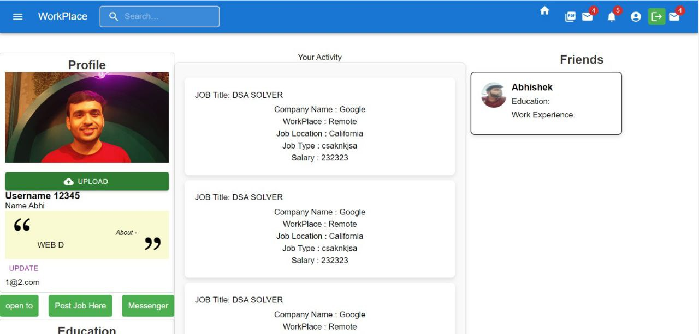
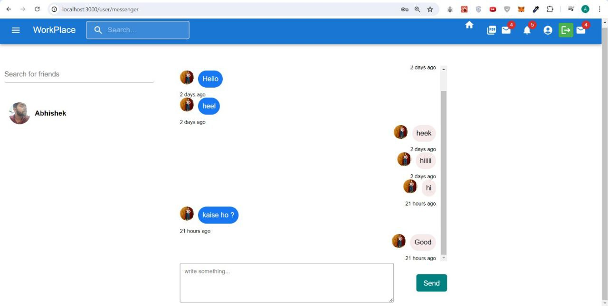
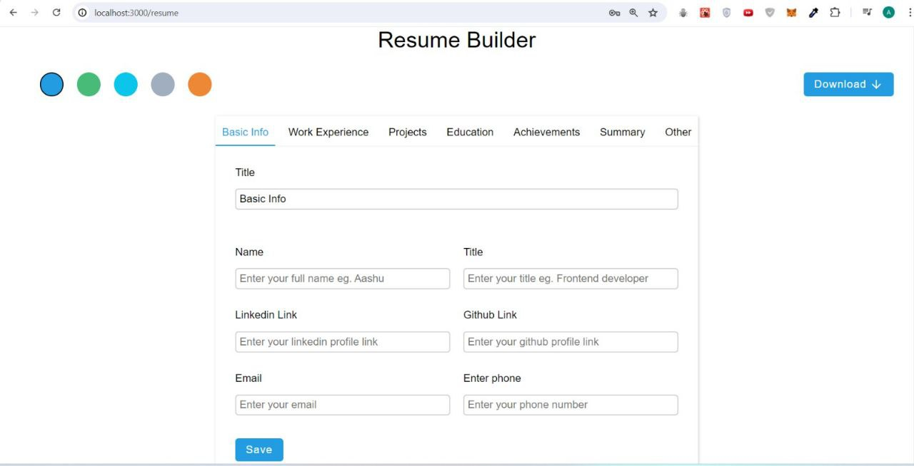
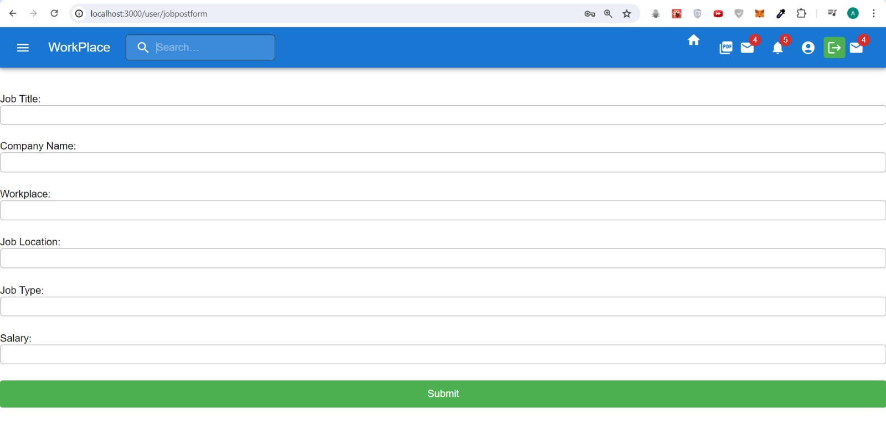

<div align="centre">

  # Workplace  
</div>

## Table of Contents
<details>
  <summary>Expand</summary>
  <ol>

- [Features](#Features)
- [Images](#Images)
- [TechStack](#TechStack)
- [Installation](#installation)
- [Maintainers](#Maintainers)
- [Technologies](#technologies)
- [License](#license)
- [Contributing](#contributing)

</ol>
</details>

## Images
<div align="centre">




<!--  -->
</div>

## Features

- Job posting and management for employers
- Real-time chat between employers and job seekers
- Real-time notifications for job applications and **critical email** updates 
- Inbuilt resume builder for job seekers
- Job searching and application for job seekers
- Profile management for both employers and job seekers

<!-- Badges -->


<!--  -->


#### [Documentation](https://github.com/ShrishRajGupta/Workplace/blob/abhishek/README.md)
#### [Request Feature](https://github.com/ShrishRajGupta/Workplace/issues)


##  TechStack 
👾
<details>
  <summary>Client</summary>
  <ul>
    <a href = "https://reactjs.org/">
    React.js </a>
  </ul>
  <ul>
    <a href = "https://redux.js.org/">
    Redux </a>
  </ul>
  <ul>
    <a href = "https://mui.com/">
    Material-UI </a>
  </ul>
  <ul>
    <a href = "https://socket.io/">
  Socket io
    </a>

  </ul>
</details>

<details>
  <summary>Server</summary>
  <ul>
  <a href = "https://nodejs.org/en/">
    Node.js</a>
  </ul>
</details>

<details>
<summary>Database</summary>
    <ul>
    <a href = "https://www.mongodb.com/" >
    MongoDB</a>
    </ul>
    <ul>
    <a href = "https://cloudinary.com" >
    Cloudinary</a>
    </ul>

</details>
<br />

## Requirements
[Workplace](https://github.com/ShrishRajGupta/Workplace) is a NodeJS application based.

For codebase use the package manager [npm](https://www.npmjs.com/) to install [Workplace](https://github.com/ShrishRajGupta/Workplace).

<br>

## Installation
```bash
git clone https://github.com/ShrishRajGupta/Workplace.git
npm install
```

### Setup Environment Variables
Create a .env file in the root directory and add the following variables:

```bash
ACCESS_TOKEN  # Secret key for JWT

CLOUDINARY_APIKEY  # Cloudinary API Key
CLOUDINARY_APISECRET  # Cloudinary API Secret
CLOUDINARY_CLOUDNAME # Cloudinary Cloud Name

MONGO_URL  # MongoDB URL
GMAIL_USER # Gmail Email
GMAIL_PASS # Gmail Password

```
#### Setup Cloudinary
- Create an account on [Cloudinary](https://cloudinary.com/)
- Get the API Key, API Secret, and Cloud Name
- Add the API Key, API Secret, and Cloud Name to the .env file

#### Setup MongoDB
- Create an account on [MongoDB](https://www.mongodb.com/)
- Create a new cluster
- Get the MongoDB URL
- Add the MongoDB URL to the .env file

#### Setup Client
```bash
cd client
npm install
npm start
```
### Start the Server
```bash
cd server
npm install
npm start
```

## Maintainers 👨‍💻
  <div>
      <p align="center">
<a href="https://github.com/ShrishRajGupta/Workplace/graphs/contributors">
  
</a></p>
  </div>

- ### [Shrish Raj Gupta](https://github.com/ShrishRajGupta)   [](https://www.linkedin.com/in/shrishrajgupta/)
- ### [Abhishek Yadav](https://github.com/AbhishekYMNNIT)  [](https://www.linkedin.com/in/abhishekyadav123/)
- ### [Shreyansh Jaiswal](https://github.com/CodeBuster09)  []( https://www.linkedin.com/in/shreyanshjaiswal09/)

## Licence 🍁
### [**MIT**](/LICENSE)  &copy; [Shrish Raj Gupta](https://github.com/ShrishRajGupta)

## Contributing 💙

PR's are welcome !Found a Bug ? 

Create an [Issue](https://github.com/ShrishRajGupta/Workplace/issues).

## 💖 Like this project ?

Leave a ⭐ If you think this project is cool.
 <p align="center"></p>
