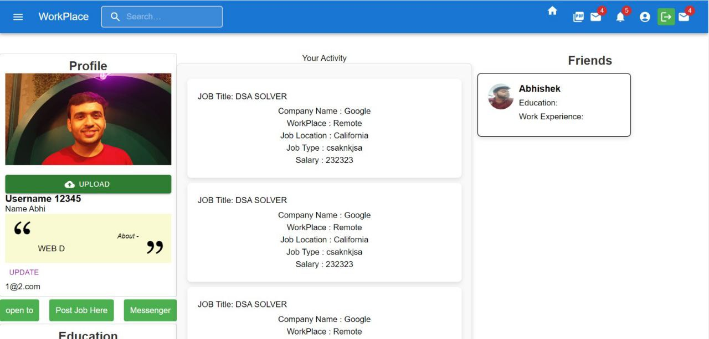
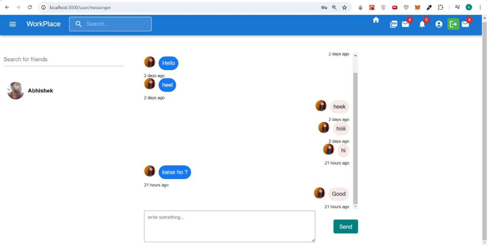
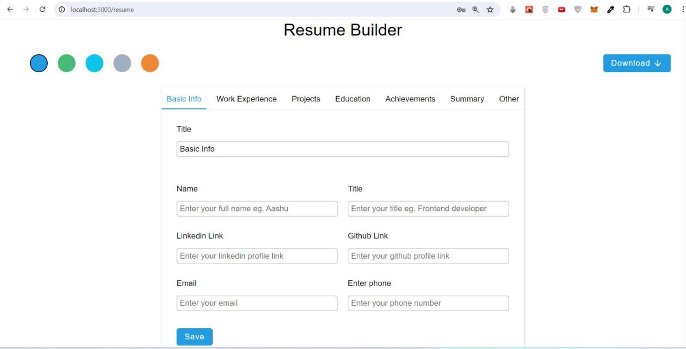

<div align="center">

  # Workplace  

  A job portal where employers post roles and job seekers apply, chat in real time, and build a resume — all in one place.

  
  
  
  

</div>

## Table of Contents

- [Features](#features)
- [Screenshots](#screenshots)
- [Tech Stack](#tech-stack)
- [Architecture](#architecture)
- [Getting Started](#getting-started)
- [Scripts](#scripts)
- [Maintainers](#maintainers)
- [License](#license)
- [Contributing](#contributing)

## Features

- Job posting and management for employers
- Real-time chat between employers and job seekers
- Email notifications for sign-up and account events
- Inbuilt resume builder for job seekers, saved to your account
- Job searching and one-click applications (with optional resume upload); employers see applicants per post
- Profile management (education, work experience, skills, photo) for both roles

## Screenshots

<div align="center">




</div>

## Tech Stack

| Layer | Technology |
|---|---|
| Client | [React](https://reactjs.org/) (Create React App), [Material UI](https://mui.com/), [socket.io-client](https://socket.io/) |
| API server | [Node.js](https://nodejs.org/en/), [Express](https://expressjs.com/), [Mongoose](https://mongoosejs.com/), JWT auth, [Nodemailer](https://nodemailer.com/) |
| Socket server | [socket.io](https://socket.io/) |
| Data | [MongoDB](https://www.mongodb.com/), [Cloudinary](https://cloudinary.com) (image storage) |

## Architecture

Workplace runs as three processes. In development they all run from one command (see below).

| Directory | Process | Default port | Purpose |
|---|---|---|---|
| `client/` | CRA dev server | 3000 | React UI. API calls are proxied to the server via the `proxy` field in `client/package.json`. |
| `server/` | Express | 3001 | REST API, auth, MongoDB, Cloudinary uploads, email. |
| `socket/` | socket.io | 8900 | Real-time chat delivery. Verifies the same auth cookie as the API (shared `ACCESS_TOKEN`); chat history itself is persisted through the REST API. |

All three must be running for the full app to work. Without `socket/`, everything except live chat still works.

## Getting Started

### Prerequisites

- Node.js 20+ (see `.nvmrc`; `nvm use` picks it up)
- A MongoDB instance (local, or a free [Atlas](https://www.mongodb.com/atlas) cluster)
- A [Cloudinary](https://cloudinary.com/) account (profile photos)
- A Gmail account with an [App Password](https://support.google.com/accounts/answer/185833) (transactional email)

### 1. Clone and install

```bash
git clone https://github.com/ShrishRajGupta/Workplace.git
cd Workplace
npm run install:all
```

### 2. Configure environment

Each app reads its own `.env` from its own directory. Copy the examples and fill them in:

```bash
cp server/.env.example server/.env   # MONGO_URL, ACCESS_TOKEN, Cloudinary, Gmail
cp socket/.env.example socket/.env   # PORT, CLIENT_URL, ACCESS_TOKEN (same value as the server's)
cp client/.env.example client/.env   # REACT_APP_PUBLIC_FOLDER (optional)
```

The comments in each `.env.example` explain every variable.

### 3. Run

```bash
npm run dev
```

This starts the client, server and socket server together with colour-coded logs. Open http://localhost:3000.

To run a single app instead, `cd` into it and use `npm start` (client) or `npm run dev` (server, socket).

## Scripts

Run from the repository root:

| Script | What it does |
|---|---|
| `npm run install:all` | Installs dependencies for the root, `client`, `server` and `socket` |
| `npm run dev` | Starts all three apps with hot reload |
| `npm run build` | Production build of the client into `client/build/` |
| `npm run lint` | ESLint over the client, syntax check over the server and socket |

CI runs `lint` and `build` on every push and pull request (`.github/workflows/ci.yml`).

## Maintainers

<p align="center">
<a href="https://github.com/ShrishRajGupta/Workplace/graphs/contributors">
  
</a></p>

- [Shrish Raj Gupta](https://github.com/ShrishRajGupta) [](https://www.linkedin.com/in/shrishrajgupta/)
- [Abhishek Yadav](https://github.com/AbhishekYMNNIT) [](https://www.linkedin.com/in/abhishekyadav123/)
- [Shreyansh Jaiswal](https://github.com/CodeBuster09) [](https://www.linkedin.com/in/shreyanshjaiswal09/)

## License

[MIT](/LICENSE) &copy; [Shrish Raj Gupta](https://github.com/ShrishRajGupta)

## Contributing

PRs are welcome. Found a bug or want a feature? Open an [issue](https://github.com/ShrishRajGupta/Workplace/issues).

If you like this project, leave a ⭐.

<p align="center"></p>
